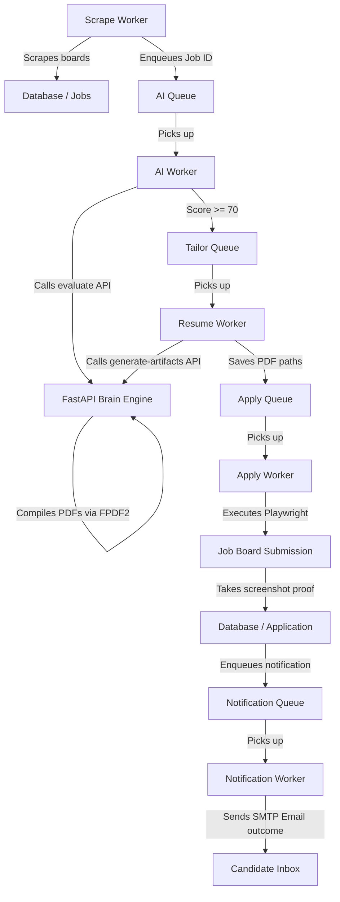

# AI Job Agent

An automated job search and application suite that scrapes job boards (LinkedIn, Greenhouse, Lever), semantic-evaluates job fit using local sentence embeddings, tailors cover letters and resumes using Groq LLM completions, compiles professional PDFs, and auto-submits applications using Playwright browser automation.

---

## System Architecture



- **`automation-engine/`**: TypeScript backend orchestrating pipeline stages via BullMQ job queues and workers. Integrates Playwright browser scripts and Prisma client databases.
- **`brain-engine/`**: Python/FastAPI service hosting the semantic search vector calculator (local MiniLM-L6) and API call completions to Groq for tailoring documents and compiling PDFs.

---

## State Machine Pipeline

Every job application transitions through the following stages:
`FOUND` ➔ `MATCHED` ➔ `TAILORED` ➔ `READY` ➔ `APPLYING` ➔ `SUBMITTED`

- **FOUND**: Crawled listing saved to database.
- **MATCHED**: Evaluated by AI and matched fit threshold (>= 70%).
- **TAILORED**: Custom, high-alignment resume markdown and cover letters generated.
- **READY**: Tailored cover letter and resume compiled into PDFs.
- **APPLYING**: Browser submission currently active via Playwright.
- **SUBMITTED**: Form successfully completed, confirmation screenshot saved.
- **FAILED**: Terminal error state during evaluate, compile, or apply.

---

## Getting Started

### Prerequisites
- Node.js (v18+)
- Python (3.10+)
- Docker and Docker Compose
- Groq API Key

---

### Step 1: Clone and Set Up Databases

1. **Clone the repository** and navigate to the directory.
2. **Launch Postgres & Redis databases** using Docker Compose:
   ```bash
   docker-compose up -d
   ```
3. **Configure the Environment**:
   Copy `.env.example` to `.env` in the root folder:
   ```bash
   cp .env.example .env
   ```
   *Fill out database credentials, SMTP accounts, and your Groq API Key (see below).*

---

### Step 2: How to Get a Free Groq API Key

1. Navigate to the **[Groq Console](https://console.groq.com/)**.
2. Sign in or create a free account.
3. Go to **API Keys** in the sidebar.
4. Click **Create API Key**, name it `ai-job-agent`, and copy the string.
5. Paste it in your `.env` file under `GROQ_API_KEY`.

---

### Step 3: Populate Your Master Resume

The AI needs your real skills to run evaluations and tailoring.
1. Open the file [master.md](file:///e:/My_personal/Projects/ongoing/ai-job-agent/brain-engine/resumes/master.md).
2. Populate it with your actual resume sections in markdown formatting.
   *Do not leave this file empty, otherwise AI endpoints will return validation errors.*

---

### Step 4: Boot up the Brain Engine (Python)

1. Navigate to `brain-engine/` and establish a virtual environment:
   ```bash
   cd brain-engine
   python -m venv venv
   source venv/bin/activate  # On Windows: .\venv\Scripts\activate
   ```
2. Install Python dependencies:
   ```bash
   pip install -r requirements.txt
   ```
3. Start the FastAPI development server:
   ```bash
   python main.py
   ```
   *The server runs on `http://localhost:8000`. You can inspect endpoints via `http://localhost:8000/docs`.*

---

### Step 5: Boot up the Automation Engine (TypeScript)

1. Navigate to `automation-engine/` and install node packages:
   ```bash
   cd ../automation-engine
   npm install
   ```
2. Run database migrations to prepare tables:
   ```bash
   npm run db:migrate
   ```
3. Seed default database rows (like the master resume schema):
   ```bash
   npm run db:seed
   ```
4. Start the development server and queue listeners:
   ```bash
   npm run dev
   ```
   *The workers are now listening on BullMQ. The health check server runs on `http://localhost:3000`.*

---

## Running Test Suites

- **TypeScript tests** (Vitest):
  ```bash
  cd automation-engine
  npm run test
  ```
- **Python tests** (pytest):
  ```bash
  cd brain-engine
  pytest
  ```

---

## ⚠️ LinkedIn Automation Disclaimer

Automated LinkedIn interaction violates their Terms of Service and commonly triggers CAPTCHA challenges, rate-limiting, or account suspensions. 
To protect your account:
- Keep `LINKEDIN_AUTOMATION_ENABLED=false` (default) until you are ready.
- Basic safeguards like randomized typing delays and realistic user-agents are integrated.
- Set `PLAYWRIGHT_HEADLESS=false` to manually solve CAPTCHA windows in headful mode if they appear.
